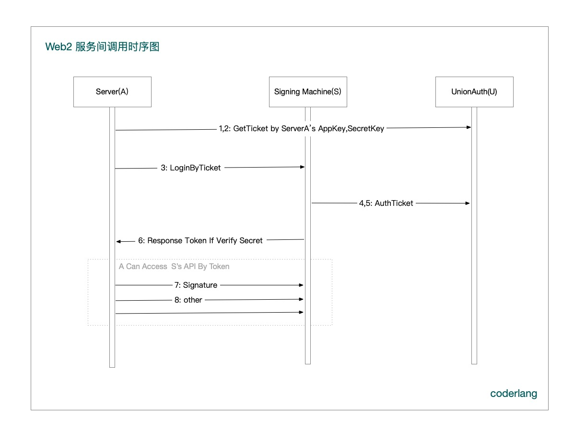
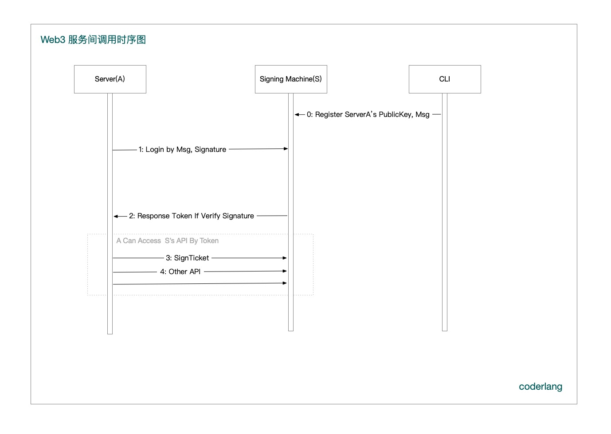

作者：coderlang 34+ 程序员，CTO，全栈工程师，搬砖 11 年，薪资翻 20 倍，公众号 coderlang 主理人

## 一、初识签名
我第一次做 Web3 IM Social 产品时，思考最多的问题，就是节点（服务器）凭什么给你（客户端）数据，这一点，和做 Web2 产品有本质区别。  

做 Web2 时，客户端想要什么数据，服务器就返回什么数据，Web3 则不是你想要什么数据，就给你，而是，凭什么给你？

凭签名！

你在授权接入节点时，存入节点的数据，你都用私钥进行了签名，公钥进行了加解密。

你在提取数据时，也需要你的签名，节点验证过了签名，才会返回数据给你，而且，你可以验证，节点有没有你的数据有没有被恶意修改过。

这样，就从技术上保证了，你的数据，只有你能解密，任何节点拿到，它也解密不出来。

## 二、私钥就是你的一切

在 Web2 的场景中，电话号码就是你的一切，通过电话号码，你可以登录任何应用，忘记密码，你都可以通过电话号码找回账号，找回数据。

在 Web3 里，私钥就是你的一切，忘记私钥，你就找不回，你的数据，资产，你的一切。

私钥通常由128位二进制数据组成，为了记住私钥，行业提出了众多解决方案，通过 BIP39 协议，将 128位二进制数据，转换为 12 个单词，即「助记词」，例如：```voice true main glow spare magic you snack dress summer cherry cash```就是一套助记词，你可以用它登录 dsyncle Web3 IM Social APP。

通过私钥可以推导出公钥，公钥和私钥是成对的，它们有 2 个作用：**加密解密**和**签名验签**，在 Web3 的产品里，会在各个场景，反复使用，比如：登录授权，服务间调用权限验证，等等。

私钥用于签名和解密消息，公钥用于验证签名和加密消息，签名用于确保消息的完整性和来源，以便接收方可以信任消息。

### 加密解密（公钥加密，私钥解密）

假设使用 coderlang 的公钥「```027951be58344fd7f2004e3c9c532562f976d0358700516d49a8ac68c5d83ba3b5```」对消息「```coderlang 34+ 程序员，CTO，全栈工程师，搬砖 11 年，薪资翻 20 倍，公众号 coderlang 主理人```」进行加密，即可得到加密过后的一长串密文数据，
而要解密该密文数据，只能通过公钥配对的私钥，进行解密，解密成功，即可得到原始消息。

我用 golang 写了 [Test_Encrypt_Decrypt](https://github.com/coderlang/blockchain-expert/blob/master/signature/signature_test.go) 单元测试，测试数据如下：  
```shell
=== RUN   Test_Encrypt_Decrypt
PrivateKey:  c47a0fb020f2066223e049ea342c5ea9e9844da92b3101d37ae115d7f13380d8
PublicKey:  027951be58344fd7f2004e3c9c532562f976d0358700516d49a8ac68c5d83ba3b5
Msg:  coderlang 34+ 程序员，CTO，全栈工程师，搬砖 11 年，薪资翻 20 倍，公众号 coderlang 主理人
PublicKey Encrypt:  0489f50b457de2ae956e4b5917a285926f45be7399084b2063efb28063433ac59f0590e9f707da564f5d92eb01a13f890cb2d3bd3e014bde10b73f9ea99d45d145bfc24b114f417e6fe49fb0e3b814e4a9783bb3b78f5cadeb67c32e222ade78dc310bc7ebb046d22217ce8b1dbcd105240512a63d6e9cc1433b88c08b5129bb0244c0143d3f8279f09e4a162e1bff0ad967cd1747f08ea1950b2d816f8b1f8678bb008786d72b0a318476aeb48f6c866ccbc2a61c0fe421ba01551304e395f94d96447c8aeb80d6df0e47cf29f717bdd253af94fc7c4b8180c0ab757f698c2139ffbc
PrivateKey Decrypt:  coderlang 34+ 程序员，CTO，全栈工程师，搬砖 11 年，薪资翻 20 倍，公众号 coderlang 主理人
--- PASS: Test_Encrypt_Decrypt (0.00s)
```
代码如下：  
```go
func Test_Encrypt_Decrypt(t *testing.T) {
	var privateKeyHex = "c47a0fb020f2066223e049ea342c5ea9e9844da92b3101d37ae115d7f13380d8"
	
	privateKeyBytes, err := hex.DecodeString(privateKeyHex)
	if err != nil {
		t.Fatal(fmt.Sprintf("decode privateKey err %v", err))
		return
	}

	privateKey, err := crypto.ToECDSA(privateKeyBytes)
	if err != nil {
		t.Fatal(fmt.Sprintf("ToECDSA privateKey err %v", err))
		return
	}
	privateKeyECC := ecies.ImportECDSA(privateKey)

	println("PrivateKey: ", hex.EncodeToString(privateKeyECC.D.Bytes()))
	println("PublicKey: ", hex.EncodeToString(crypto.CompressPubkey(privateKeyECC.PublicKey.ExportECDSA())))

	msg := "coderlang 34+ 程序员，CTO，全栈工程师，搬砖 11 年，薪资翻 20 倍，公众号 coderlang 主理人"
	fmt.Println("Msg: ", msg)

	encrypt, err := ecies.Encrypt(rand.Reader, &privateKeyECC.PublicKey, []byte(msg), nil, nil)
	if err != nil {
		t.Fatal(err)
	}

	fmt.Println("PublicKey Encrypt: ", hex.EncodeToString(encrypt))

	decrypt, err := privateKeyECC.Decrypt(encrypt, nil, nil)
	if err != nil {
		t.Fatal(fmt.Sprintf("Decrypt err %v", err))
		return
	}

	if !bytes.Equal(decrypt, []byte(msg)) {
		t.Fatal("ecies: plaintext doesn't match message")
	}

	println("PrivateKey Decrypt: ", string(decrypt))
}
```

在 IM 消息场景里，我们就可以使用公钥私钥，对消息进行加解密，比如，张三想给 coderlang 发送加密消息，则可以使用 coderlang 的公钥进行加密，coderlang 收到加密消息，则通过自己的私钥进行解密，反过来，coderlang 也可以使用张三的公钥，给张三发加密消息。

这种设计，就有一个问题，如果是群聊，一个 50 万的群，这样的加解密方式，势必导致 IM 发送消息效率降低，发一条消息，需要用群里的 50 万个成员公钥，进行加密，通信效率可想而知。

为了解决这个问题， 我们可以，通过将其和对称加密结合起来，公私钥加解密的不是消息本身，而是一个对称加密的密钥，比如 AES 的 key， 而消息则用对称加密密钥进行加解密。

### 签名验签（私钥签名，公钥验签）

使用 coderlang 的私钥「```c47a0fb020f2066223e049ea342c5ea9e9844da92b3101d37ae115d7f13380d8```」对消息「```coderlang 34+ 程序员，CTO，全栈工程师，搬砖 11 年，薪资翻 20 倍，公众号 coderlang 主理人```」进行签名，
得到签名数据 Signature，接收方，根据 Signature 和 消息的Hash，进行验证，即可知道消息的真实性。

假设，有人在传输消息过程中，恶意将消息“搬砖 11 年，薪资翻 20 倍”更换成了“搬砖 11 年，薪资翻 200 倍”，那节点拿到 Signature 和错误消息 Hash，恢复出来的公钥，一定不是 coderlang 的公钥。

我用 golang 写了 [Test_Encrypt_Decrypt](https://github.com/coderlang/blockchain-expert/blob/master/signature/signature_test.go) 单元测试，测试数据如下：

coderlang 正确的公钥，应该是「```027951be58344fd7f2004e3c9c532562f976d0358700516d49a8ac68c5d83ba3b5```」，而错误消息 Hash 恢复出来的公钥是「```03ebadb0dcf548321b14590141b4932f7cda18e35fffd771013da8a183c183921d```」。

```shell

PrivateKey:  c47a0fb020f2066223e049ea342c5ea9e9844da92b3101d37ae115d7f13380d8
PublicKey:  027951be58344fd7f2004e3c9c532562f976d0358700516d49a8ac68c5d83ba3b5
Address:  0x301A70769871B16cA9c4E338c9515BdD7c79407D
Msg:  coderlang 34+ 程序员，CTO，全栈工程师，搬砖 11 年，薪资翻 20 倍，公众号 coderlang 主理人
Hash:  dee518afc392f58271028fc7a6961a3bb482c0b26cb076a81a6415b11957cbc9
Signature:  f5ea3d0a8958f34164339e70fa9451ec93a3a4490131d6e051c5d3b0c21d5efa7c776acfc3f8dccd8aa3fad88d43f190bc9b1cca927737ded808ccca1117066d01
SigToPub PublicKey:  027951be58344fd7f2004e3c9c532562f976d0358700516d49a8ac68c5d83ba3b5
InvalidMsg:  coderlang 34+ 程序员，CTO，全栈工程师，搬砖 11 年，薪资翻 200 倍，公众号 coderlang 主理人
InvalidSigToPub PublicKey:  03ebadb0dcf548321b14590141b4932f7cda18e35fffd771013da8a183c183921d
--- PASS: Test_Sign_Verify (0.00s)
```

测试代码如下：

```go
func Test_Sign_Verify(t *testing.T) {
	var privateKeyHex = "c47a0fb020f2066223e049ea342c5ea9e9844da92b3101d37ae115d7f13380d8"
	privateKeyBytes, err := hex.DecodeString(privateKeyHex)
	if err != nil {
		t.Fatal(fmt.Sprintf("decode privateKey err %v", err))
		return
	}

	privateKey, err := crypto.ToECDSA(privateKeyBytes)
	if err != nil {
		t.Fatal(fmt.Sprintf("ToECDSA privateKey err %v", err))
		return
	}
	publicKey := privateKey.PublicKey

	println("PrivateKey: ", hex.EncodeToString(privateKey.D.Bytes()))
	println("PublicKey: ", hex.EncodeToString(crypto.CompressPubkey(&publicKey)))
	println("Address: ", crypto.PubkeyToAddress(publicKey).Hex())
	// 要签名的数据
	msg := "coderlang 34+ 程序员，CTO，全栈工程师，搬砖 11 年，薪资翻 20 倍，公众号 coderlang 主理人"
	fmt.Println("Msg: ", msg)
	// 对数据进行哈希
	hash := crypto.Keccak256([]byte(msg))
	fmt.Println("Hash: ", hex.EncodeToString(hash))
	// 使用私钥对数据哈希进行签名
	signature, err := crypto.Sign(hash, privateKey)
	if err != nil {
		fmt.Println("Error signing data:", err)
		return
	}

	// 打印签名
	fmt.Println("Signature: ", hex.EncodeToString(signature))
	sigToPub, err := crypto.SigToPub(hash, signature)
	if err != nil {
		fmt.Println("Error SigToPub:", err)
		return
	}

	println("SigToPub PublicKey: ", hex.EncodeToString(crypto.CompressPubkey(sigToPub)))

	invalidMsg := "coderlang 34+ 程序员，CTO，全栈工程师，搬砖 11 年，薪资翻 200 倍，公众号 coderlang 主理人"
	fmt.Println("InvalidMsg: ", invalidMsg)
	invalidSigToPub, err := crypto.SigToPub(crypto.Keccak256([]byte(invalidMsg)), signature)
	if err != nil {
		fmt.Println("Error SigToPub:", err)
		return
	}
	println("InvalidSigToPub PublicKey: ", hex.EncodeToString(crypto.CompressPubkey(invalidSigToPub)))
}
```

## 三、公私钥签名验签应用（一）：微服务权限验证

### Web2 实现服务间调用的常见思路

继续阅读之前，请你思考一个问题，在 Web2上，你们服务间调用是如何做的？

我在 20 年，做一款家医产品，涉及用户端，医生端等众多服务，各端之间，要相互调用，存取数据。

那时，我们构建了一个统一认证服务中心，即：UnionAuth，如下图所示：


简单来说，所有服务，要相互通信，需要在 UnionAuth 注册，由 UnionAuth 统一分配唯一的 AppKey 和 SecretKey。

Server1 要调用 Signing Machine 签名机器的接口，总共需要 8 步。

1,2: Server1 使用 AppKey、 SecretKey 向 UnionAuth 拿访问 Signing Machine 的临时凭证 Ticket。  

3,6: Server1 拿到临时凭证 Ticket 登录 Signing Machine，请求分配 Token。  

4,5: Signing Machine 拿到临时凭证 Ticket 到 UnionAuth 验证，验证通过，则为 Server1 颁发 Token。  

8: Server1 拿到 Token，像客户端一样，开始请求 Signing Machine 提供的接口。  

时序图如下：



虽然，第 8 步，以后，Server1 访问 Signing Machine，不再需要 UnionAuth。

但当 Token 过期了，还是需要借助 UnionAuth 从第 1 步开始，再次执行获取 Token的流程，这就可能出现：单点故障，只要 UnionAuth 服务挂了，整套系统，都会受到严重的影响。


### Web3 巧妙解决 Web2 UnionAuth 单点故障

接下来，一起思考下，在 Web3 上，如何解决 UnionAuth 单点故障？

在 Web3上，不是解决 UnionAuth 单点故障，而是不再需要 UnionAuth，则依然可以，实现服务之间的安全访问。

访问过程，缩短到只需要 3 步，如下图所示：


Server1 需要访问 Signing Machine 签名机器的服务，则将 Server1 的公钥，约定的签名 Msg 以及 Msg 的签名，提供给 Signing Machine 注册。

注册好了，则 Server1 即可访问 Signing Machine，步骤如下：

1,2: Server1 用自己的私钥，对 Signing Machine 约定的签名 Msg 进行签名, Signing Machine 收到签名，则进行验签，验证通过，则返回 Token。

8: Server1 拿到 Token，像客户端一样，开始请求 Signing Machine 提供的接口。

Token 过期了，再次执行 1, 2 步，则可以实现，自动登录，时序图如下：



请再思考一个问题，第 1,2 步用于登录Signing Machine的签名数据，可能导致重放，即用过了，还可以被恶意使用，如何解决这一问题？

可以参考 ETH 网络，增加 Nonce，每次签名加 1，Signing Machine，用过即废。

## 四、公私钥签名验签应用（二）：签名授权

请你回忆一下，在 Web2 的场景里，你是怎么做账号登录的，常见的方式有手机号 + 验证码，邮箱 + 验证码，通过数据库的唯一索引，给你分配一个唯一的 UID。

Web3 则不需要验证码，而是通过你的私钥签名授权，通过你的签名数据，节点（服务器）可以推导出你公钥，以及对应的唯一地址，如：```0xc3eA7f07Aa485762a5687074c91D9aA9E5Af1d29```，而地址就类似于 Web2 的 UID 。


## 五、公私钥加密解密应用（一）：消息加解密

在初识签名中，我介绍过，IM 消息场景里，我们可以使用公私钥，对消息进行加解密，结合 AES 对称加解密，可以实现 50 万用户的加密群聊。

举一个例子，A 创建一个公开群 G 时，A 会为公开群 G 随机生成一个消息加解密的密钥 Key，接下来，A 用自己的公钥，对 Key 进行加密，将加密后的密文数据，即：钥匙，放入节点（服务器），而消息的密钥本身，只在客户端内存。

一个用户，加入 G 群有 2 中方式，A 主动邀请或者扫描 A 的邀请二维码，A 主动邀请 B 、 C 时，则可以直接用 B 、 C 的公钥，对 Key 进行加密，生成 B、 C 各自的钥匙。

但，当 D 扫描 A 在 G 群的邀请二维码，加入公开群时，A 不一定在线，则不能及时给 D 配钥匙。

因此，节点（服务器），将 D 入群命令，分发给A 、 B 、 C，由 A 、 B 、 C 在线的任意用户，只要由 Key，都可以给 D 配钥匙，关键流程如下图：


## 六、公私钥加解密应用（二）：图片、视频、文件等加解密

