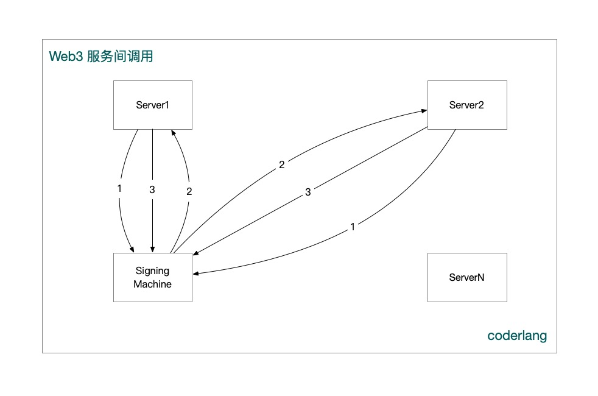

### 账号登录

### web2 怎么实现登录？

手机号+验证码，邮箱+验证码，服务器拿到手机号，邮箱，依靠数据库唯一索引，分配uid。

web3 不叫登录，叫授权，节点拿到，签名数据，即可通过签名，知道你的地址，而地址就是唯一的。

比如，dsyncle，使用助记词授权，

签名，是用私钥签的，私钥本质是，为了方便记住，因此，有了助记词。

### 微服务

「业务 1 」需要访问「签名机器」的签名服务，需要 3 个步骤

1：「业务 1」用自己的私钥，对某个数据进行签名，请求签名机器分配 Token
2：签名机器，签证，签名，分配 Token
3：业务 1，可以访问签名机器相关接口。